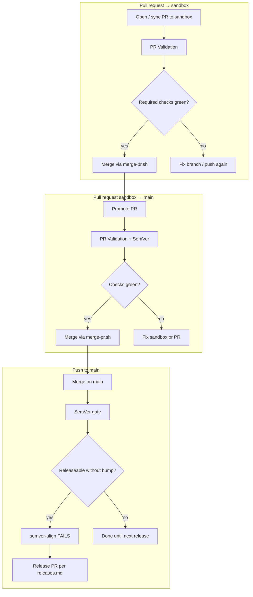

# Delivery automation map

What runs on each GitHub event — **no ad-hoc “decide when”**. Agents and CI follow this table; humans intervene on **red** gates.

Canonical prose: [`git-workflow.md`](./git-workflow.md), [`releases.md`](./releases.md), [`delivery-verification.md`](./delivery-verification.md).

Adapted from [AIOS `delivery-automation.md`](https://github.com/KleilsonSantos/ai-operating-system/blob/main/docs/guides/delivery-automation.md) (flow only — no AIOS engines).

## Event → next action



| Git event | Workflows / jobs | SemVer | Next step |
|-----------|------------------|--------|-----------|
| **PR** → `sandbox` | PR Validation (`Issue link`, `PR base policy`, tests, Bandit, `Version SSOT`, `Protocol gate`) | No | Merge when **required** checks green — `bash scripts/merge-pr.sh <n>` |
| **PR** → `main` (promote) | Same + SemVer alignment | Yes | Body prefers `Closes #N`; merge only via `merge-pr.sh` |
| **Push** → `sandbox` / `main` | Branch protection + Delivery watch (inventory) | On `main` path | Integrate; open promote when slice ready |
| Dependabot PR → `sandbox` | Same as work PR (`issue-link` skipped for Dependabot) | No | Review → merge → promote |

Two PRs per delivery ([ADR-0001](../adr/0001-sandbox-branching-strategy.md)): `branch → sandbox`, then `sandbox → main`.

**One slice at a time:** one Issue → one work PR → one promote. Do not open cascading fix PRs for the same slice. Tag only when SemVer requires a bump ([releases.md](./releases.md)).

## Local gate (before push / `gh pr create`)

```bash
bash scripts/check-pr-delivery-gate.sh
# or draft text:
PR_BASE=sandbox PR_HEAD="$(git branch --show-current)" \
  PR_TITLE='ci(delivery): … (#91)' PR_BODY='Refs #91' \
  bash scripts/check-pr-delivery-gate.sh
```

Diagnose issue-link failures **on the laptop**, not by opening broken PRs.

## CI babysit (agents)

Prefer **async**: open/update PR → continue other work → re-check when settled (`gh pr checks <n>`).

If the owner asks for blocking watch: `gh pr checks <n> --watch`.

**Never merge on red required checks.** Use `bash scripts/merge-pr.sh <n>` (refuses red).

Delivery watch inventories open PRs (artifact + summary). It is **not** a second CI and must not replace this map:

| Event | Behaviour |
|-------|-----------|
| `schedule` / `workflow_dispatch` | Exit **1** only on ADR-0001 base-policy violations (`main` ← head ≠ `sandbox`, unless `ci:allow-main-base`) |
| `workflow_run` (after PR Validation) | Report only (exit 0) — must not redden the PR under test |
| Check failures on open PRs | Always listed in the summary; **never** a hard-fail (avoids self-contagion via `Open PR hygiene inventory`) |

Do **not** add Delivery watch to branch-protection required checks. Close or retarget stale `main`←non-sandbox PRs instead of opening meta-PRs to `main`.


## Issue-first (agents and humans)

Every **human-driven** slice: **Issue → branch → PR → sandbox → promote**. PR body must include `Refs #N` (work) or `Closes #N` (promote when finishing).

**Only** Dependabot/Snyk (label `ci:no-issue-required` / script skip) may omit Issues. If an agent *orchestrates* merging bot PRs, open a tracking Issue for that orchestration.

Cursor rule: `.cursor/rules/issue-first-delivery.mdc` (`alwaysApply`).

## SemVer anti-drift

`scripts/check-semver-alignment.sh` — releaseable commits (`feat`/`fix`/…) after last `v*` tag require VERSION bump + CHANGELOG section. Non-releaseable alone: `chore`, `docs`, `ci`, `test`, `style`, `build`, `merge`, Dependabot `chore(deps):`.

See [releases.md](./releases.md) · [ADR-0002](../adr/0002-canonical-semver-releases.md).

## Related

- [git-workflow.md](./git-workflow.md)
- [delivery-verification.md](./delivery-verification.md)
- [AIOS delivery-automation](https://github.com/KleilsonSantos/ai-operating-system/blob/main/docs/guides/delivery-automation.md) (reference)
